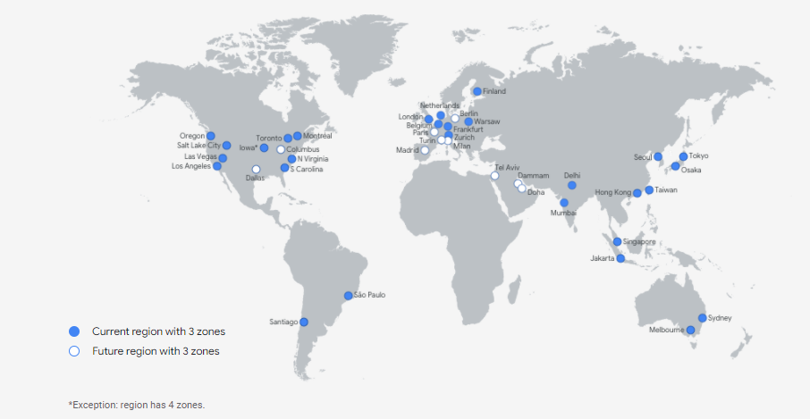

### Google Bulut Platformu Nedir?

Bunu, Google tarafından sunulan Bulut Hizmetleri koleksiyonu olarak düşünebilirsiniz. Platform, aşağıdakilerden oluşan geniş bir hizmet yelpazesine ev sahipliği yapmaktadır.
>hesaplama
>Depolamak
>Uygulama geliştirme

Şimdi bu hizmetlere kimler erişebilir? Bunlara geliştiriciler, bulut yöneticileri ve diğer kurumsal BT uzmanları tarafından erişilebilir. Bu, genel internet veya özel bir ağ bağlantısı aracılığıyla yapılabilir.

### GCP'nin bazı temel işlevlerini ve hizmetleri

**Google Compute Engine**: Google Compute Engine, Google'ın yenilikçi veri merkezlerinde ve dünya çapındaki fiber ağında çalışan VM sunmanıza yardımcı olur. Tek örneklerden küresele ölçeklendirmenize ve yük dengeli bulut bilgi işlem uygulamanıza olanak tanır.

**App Engine**: Bu PaaS teklifi, geliştiricilerin Google'ın ölçeklenebilir barındırma hizmetine erişmesine olanak tanır. Geliştiriciler ayrıca App Engine üzerinde çalışan yazılım ürünleri geliştirmek için yazılım SDK'larına erişmekte özgürdür.

**Cloud Storage**: Google Bulut Depolama platformu, büyük, yapılandırılmamış veri kümelerini depolamanıza olanak tanır. Google ayrıca NoSQL ilişkisel olmayan depolama için Cloud Datastore, MySQL için Cloud SQL tam ilişkisel depolama ve Google'ın yerel Cloud Big tablo veritabanı gibi veritabanı depolama seçenekleri de sunar.

**Google Container Engine**: Google'ın genel bulutunda çalışan Docker kapsayıcıları için bir yönetim ve düzenleme sistemidir. Google Container Engine, Google Kubernetes konteyner düzenleme motorunu temel alır.

### Dünya haritası üzerinde GCP lokasyonları

