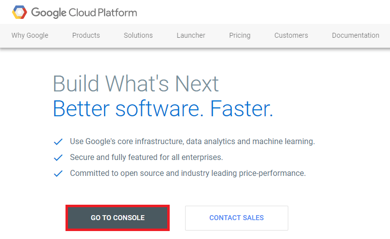
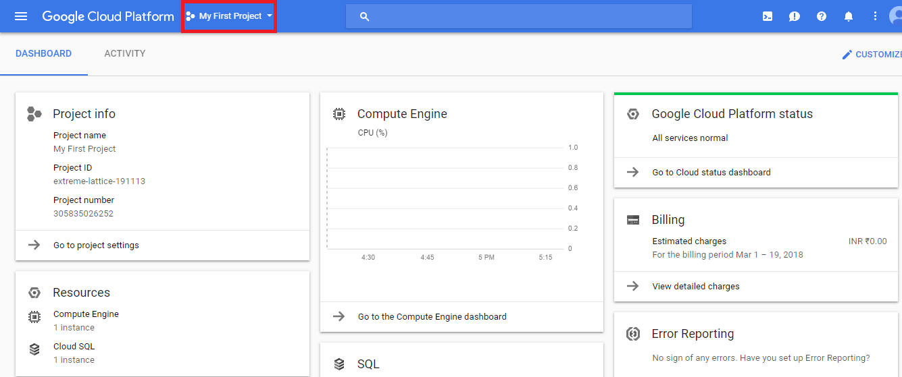
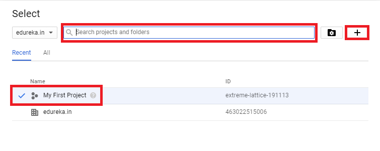
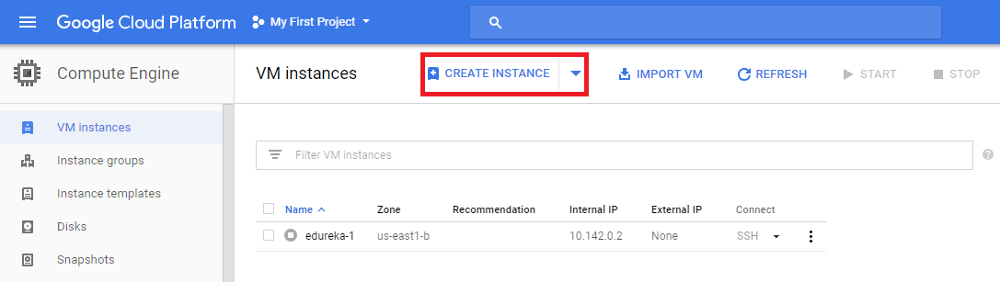
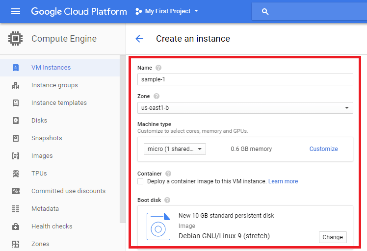
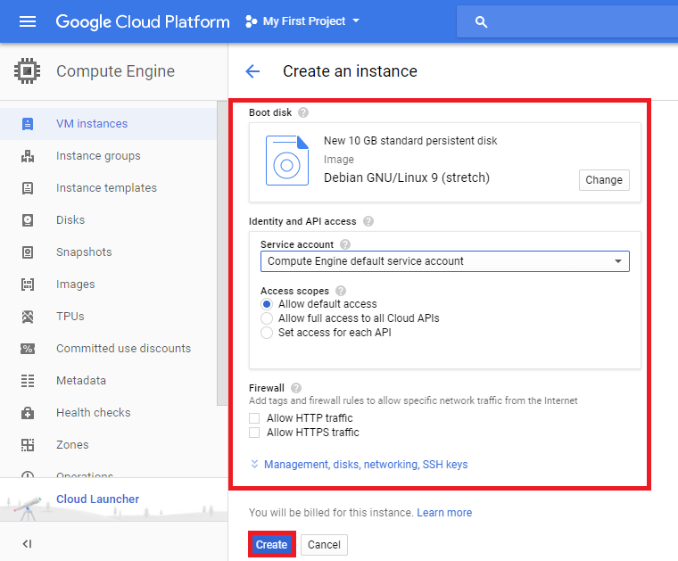
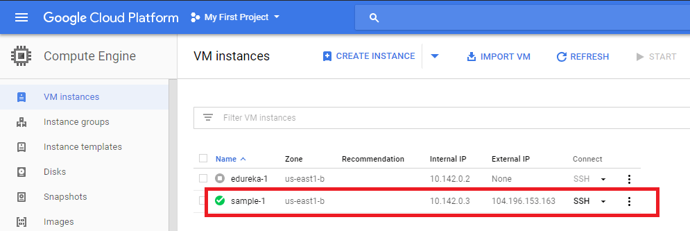

#### GCP İlk VM

1.Aşama: Bir hesabınızı oluşturduktan sonra aşağıda gösterilen web sayfasını açmak için bu bağlantıya tıklayın (https://cloud.google.com/). Devam edin ve Konsola Git'e tıklayın.

2.Aşama: Aşağıdaki web sayfası açılmalıdır. Sol üst köşede bir açılır seçeneğiniz olacak. Varsayılan olarak seçilmiş bir projeye sahiptir. Daha fazla seçenek keşfetmek için üzerine tıklayın.

3.Aşama: Sonraki görünen Web sayfası, arama sekmesinde arama yaparak veya yeni bir tane eklemek için artı işaretine tıklayarak mevcut bir projeyi seçmenizi sağlar. Yeni bir proje eklediğinizde, ilk zamanlayıcılar iki adımlı basit bir işlem olan faturalandırma seçeneğini ayarlamanızı gerektirecektir. Burada varsayılan seçenekle devam edeceğim:

4.Aşama: Ardından sol üst köşedeki açılır seçeneğe tıklayın ve **Compute Engine** Seçeneğini seçin.

5.Aşama: Şimdi, aynısını oluşturmak için **Create instance** butonuna tıklayın.

6.Aşama: Ardından devam edin ve örneğiniz için ayrıntıları doldurun. Örnek özelliklerinizi ihtiyaçlarınıza göre özelleştirebilirsiniz. Örneğin maliyetin, seçtiğiniz konuma ve belleğe göre değişebileceğini unutmayın.

7.Aşama: Ayrıntıları doldurun ve ardından **create** butonuna tıklayın.

8.Aşama: Ve işte artık kullanımınıza hazır bir instance var.

