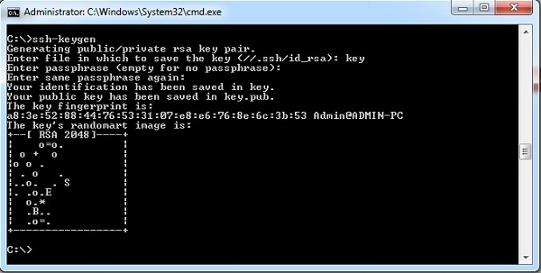
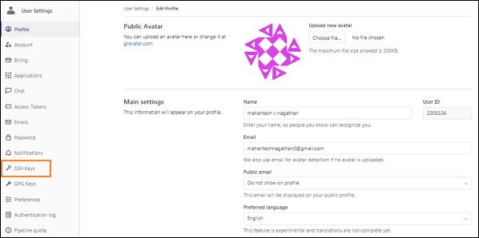
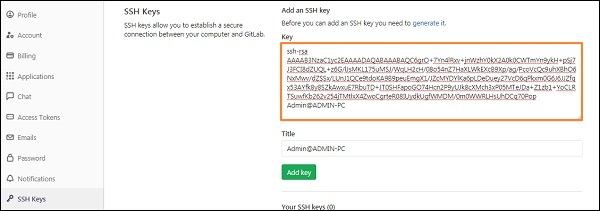
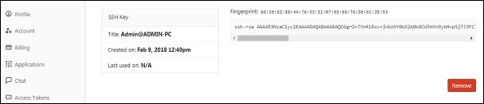

# Gitlab ssh key ayarları

>cmd veya git bash üzerinden **ssh-keygen** komutu çalıştırılır

>Gitlab hesabınıza giriş yaptıktan sonra ayarlar seçeneğine tıklanır

>sol tarafa menüde yer alan ssh keys kısmına tıklanır

>şimdi ise **.pub** uzantılı oluşna dosya komu açılır

>şimdi ise .pub uzantılı dosyayı açıp dosya içeriğini gitlab da key kısmına kopyalanır

>son olarak **add key** butonuna tıklanır ve işlem bitmiş olur

