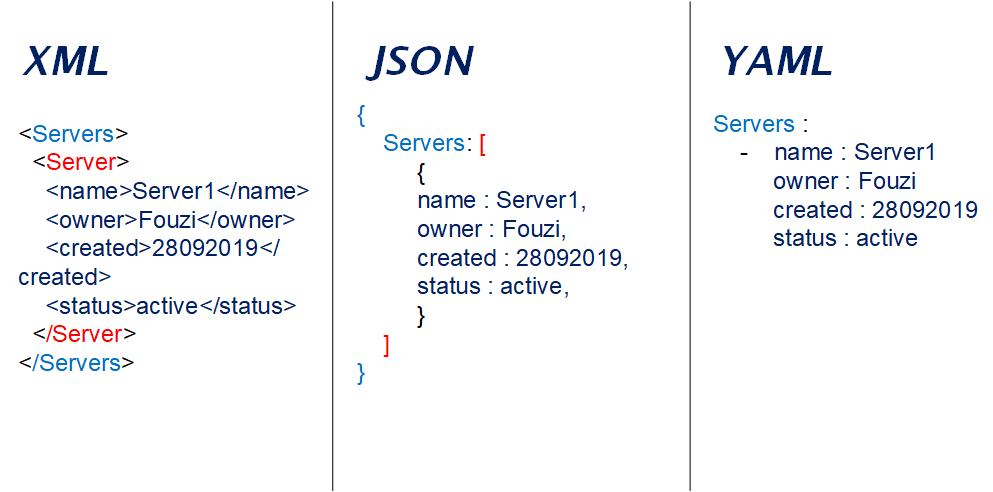

# YAML vs JSON vs XML

##YAML
* Okuması oldukça kolaydır
* Minimalist bir syntax e sahiptir
* Yalnızca veri için tasarlanmıştır
* JSON a benzer satır içi bir stile sahiptir
* Yorum satırı vardır
* Çift tırnak kullanmadan string veri girdisine izin verir

Kullanım alanları: Devops da pipeline oluşturmak için, kubernetes, docker ve ansible gibi teknolojilerde kullanılmaktadır

##JSON
* Okuması zordur
* Açk ve Katı bir syntax e sahiptir
* YAML ile benzer satır içi stile sahiptir
* Yorum satırı yoktur
* String verilerde çift tırnak kullanmak zorunludur

Kullanım alanları: Web geliştircilerin http üzerinden veri gönderimi için favori serialization formatıdır

##XML
* Okuması zordur
* Çok ayrıntılıdır
* Etiket özelliği gibi YAML a oranla daha fazla özelliğe sahiptir
* Katı bir şeması vardır

Kullanım alanları: kompleks projeler için gereklidir, validation kontörlü, şemalar ve namespace işlemleri için tercih edilir

